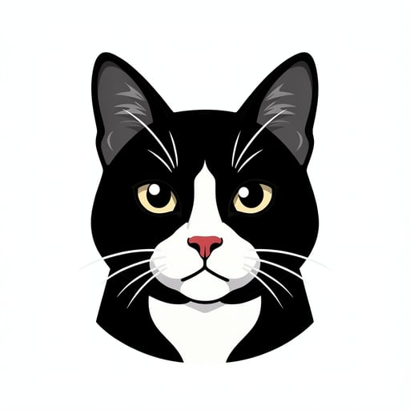
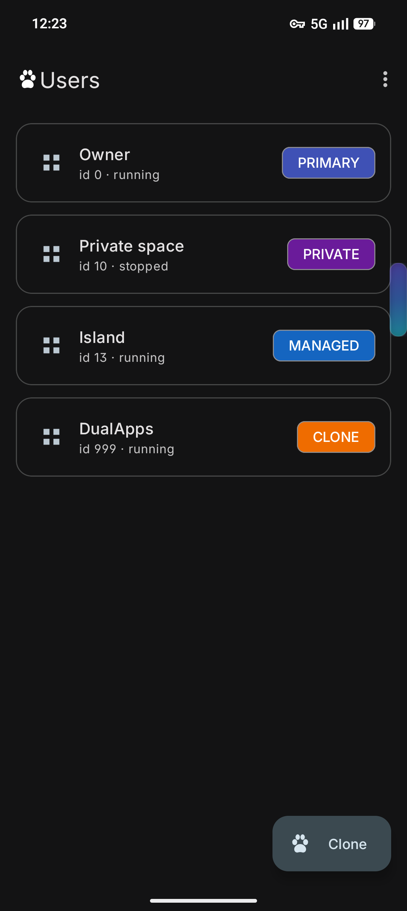
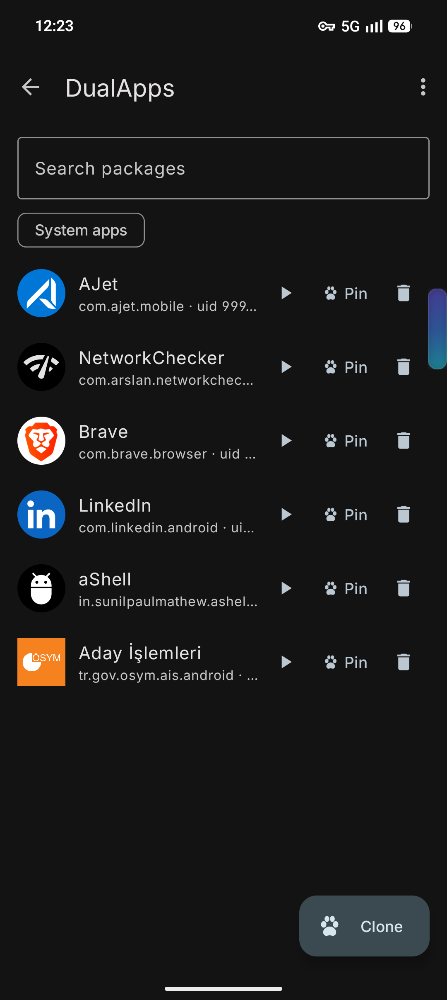
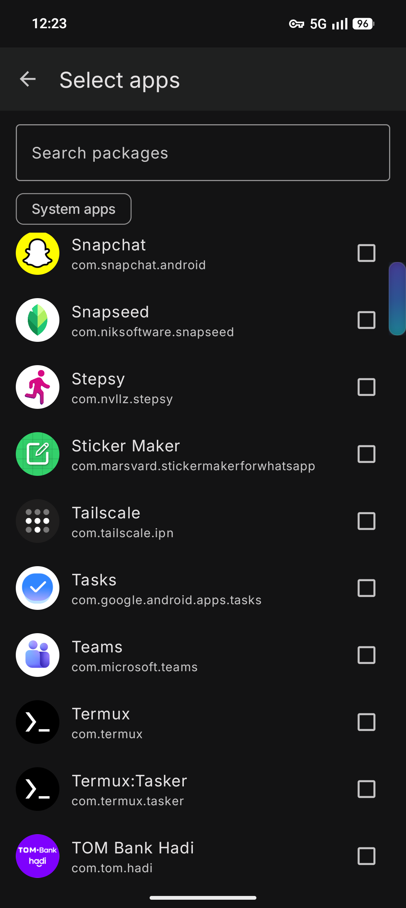

<p align="center">
  
</p>

<h1 align="center">CloneCat</h1>

CloneCat manages apps across all Android users on a device work profile, private space, clone/dual apps user and secondary users and pins home screen shortcuts that launch an app inside another user.

No root, no PC, no ADB cable. Everything runs on-device through Shizuku.

## Screenshots

<p align="center">
  
  
  
</p>

<p align="center">User list &middot; apps of a user &middot; picking apps to install into a user</p>

## Features

- List every user the device has, with app counts and status
- Browse installed apps of any user, including system apps
- Install an app that already exists on the main user into another user
- Uninstall apps from a specific user without touching the main profile
- Start a stopped or idle user
- Unlock a locked private space when an action needs it
- Back up and restore per-user app selections and pinned shortcuts

## Home screen shortcuts

Pin a shortcut that opens an app inside another user directly from the launcher.

- Per-user badge colors
- Custom icons and labels
- Optional colored ring around the icon
- Target app is resolved at launch time, so shortcuts survive app updates
- Work, clone and private space apps open on top of the current screen
- Full secondary users require a user switch, always confirmed first

## Requirements

- Android 11 (API 30) or newer
- Shizuku installed and running
- The users must already exist on the device

CloneCat does not create or delete Android users. Set the profiles up in system Settings first.

## Build

```bash
./gradlew assembleDebug          # build
./gradlew installDebug           # build + install on connected device
./gradlew lint                   # Android lint
```

compileSdk 36, targetSdk 36, minSdk 30. Views + viewBinding, no Compose. AGP 9 built-in Kotlin support.

## Known device limits

- `install-existing` into a clone user fails for third-party APKs on many ROMs. CloneCat falls back to a session install of the main user's APK and splits; if the ROM blocks that too, the OEM Dual Apps screen is the only route.
- Some ROMs stop idle background users, so CloneCat starts a user before acting on it.
- A locked private space reports `not running` / `not unlocked` until it is unlocked.

## Privacy

No account, no ads, no analytics. No internet permission. Everything stays on the device.
